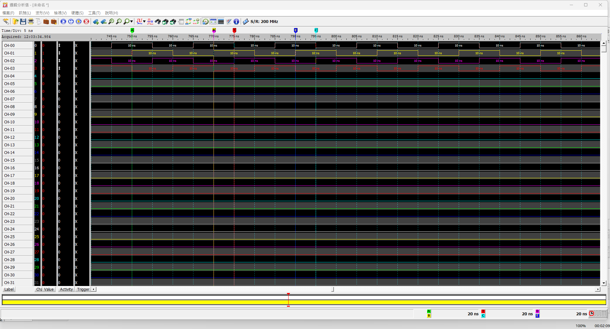
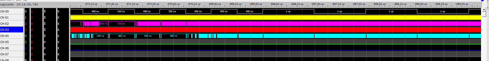

# dynamic_pll_phase_test

Quartus project for a dynamic PLL phase / variable-frequency DPWM test on a **DE25-Standard** board.

- PLL: 50 MHz in → 100 MHz out, four phases (0°, 90°, 180°, 270°)
- GPIO[0]: DPWM output
- GPIO[1:4]: PLL clock phases (0/90/180/270°)

## Automatic test sequence

| State | Frequency | Falling-edge phase |
|-------|-----------|---------------------|
| 00    | 500 kHz   | 0°                  |
| 01    | 500 kHz   | 270°                |
| 10    | 1 MHz     | 0°                  |
| 11    | 1 MHz     | 270°                |

Each state lasts a fixed number of complete DPWM periods (not a fixed time), so 500 kHz and 1 MHz show the same number of periods on a logic analyzer.

## Project layout

- `variable_frequency_dpwm_test.sv` — top-level module
- `pll_4phase.ip`, `pll_4phase/` — generated IOPLL IP core
- `dynamic_freq_phase_test.qpf/.qsf` — Quartus project/settings files
- `docs/images/` — captured waveforms

Build artifacts (`output_files/`, `db/`, `qdb/`, `dni/`, etc.) are regenerated by Quartus and excluded via `.gitignore`.

## Captured waveforms

**Four-phase 100 MHz PLL outputs** — logic analyzer capture (200 MHz sample rate, 5 ns/div) showing CH-00…CH-03 each running at a 10 ns period, phase-shifted relative to one another (0°/90°/180°/270°):

**Dynamic DPWM frequency/phase switching** — CH-00 (yellow) is the DPWM output transitioning between the ~1 MHz and 500 kHz test states; CH-02/CH-04 show the associated phase-shifted PLL clocks during the switch:

